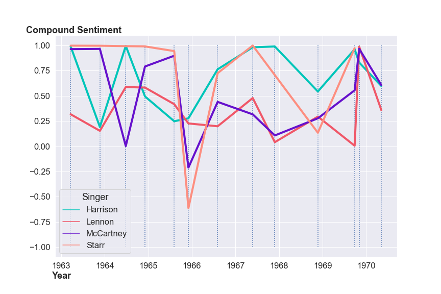

# AI Generated Lyrics from Your Favorite Beatle

## Contents
- Notebooks 
Three separate notebooks describing the process of [getting the data](get_songs.ipynb), [analyzing the data](text_analysis.ipynb), and [creating the lyric generator](colab_notebook.ipynb) the resulting model
- [/Data](/Data) 
The various files containing the data I collected and used
- [/helper_functions](/helper_functions) 
Python files that make the notebooks work
- [/Images](/Images) 
Important images used in the analysis and presentation
- [streamlit_app.py](streamlit_app.py) 
Run this file to explore the lyric generator app
- [Presentation Slide Deck](BeatlesSlides.pdf) 

## Description
This projects explores the lyrics behind The Beatles through NLP with NLTK and NMF. Also, there is a lyric generator based on The Beatles using GPT-2 and streamlit.

## Tools Used
- Natural Language Processing
- Topic Modeling
- Sentiment Analysis
- NLTK
- NMF
- GPT-2
- Seaborn
- Matplotlib
- Numpy
- Pandas
- JSON

## Potential Impact & Use
The lyric generator itself is mostly for fun, but the concept of a lyric generator can be used by artists. As a songwriter, I plan on creating my own lyric generator trained on lyrics I've written to help me out when I'm in a rut. As for the analysis, one specific insight popped out, and that was the fact that Ringo as the most negative sentiment on Rubber Soul. I always thought Ringo sang about funny topics, but this proved my assumption wrong.

